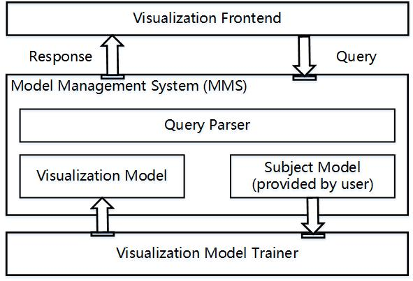

# Design
*DeepVisualInsight visualizes the training process of a classification neural network. We make this tool a plugin of tensorboard thus more user-friendly to other research. So this implementation mainly contains two parts: DeepVisualInsight backend and a tensorboard plugin frontend.*.

Our design includes three parts, which are Tensorboard frontend (frontend), middle layer server (server), and MMS backend (Model Management System backend). You are free to run each part in different positions, as long as the machines that running frontend and server are in the same Local Area Network. This user guide will show how to run it locally. For the frontend part, due to the technical issues of the original implementation of Tensorboard, we now only support it to be run on Linux or macOS operating system.



## query parser
```typescript
fetch("http://"+ip_address+":5000/animation", {
        method: 'POST',
        body: JSON.stringify({"cache": this.DVIUseCache, "path": this.DVIsubjectModelPath,  "iteration":iteration,
              "resolution":this.DVIResolution, "data_path": this.DVIsubjectModelPath + '/data'}),
        headers: headers,
        mode: 'cors'
      })
```
## MMS
```python
# init
content_path = '\path\to\content'
mms = MMS(content_path, model_structure, epoch_start, epoch_end, period, repr_num, class_num, classes, low_dims=2,
                 cmap="tab10", resolution=100, neurons=None, temporal=False, transfer_learning=True, batch_size=1000,
                 verbose=1, split=-1, advance_border_gen=False, attack_device="cpu")
################### Trainer #####################
################### Backend API #####################
################### Evaluation Functions #####################
################### Visualization #####################
################### Case Studies Related #####################

```
### Visualization Model Trainer
```python
mms.data_preprocessing()
mms.visualization_for_all()
mms.save_evaluation()
```
### Backend APIs
```python
'''get autoencoder model'''
encoder = mms.get_proj_model(epoch_id)
decoder = mms.get_inv_model(epoch_id)


'''Dimension reduction'''
embedding = mms.batch_project(data, epoch_id)
embedding = mms.individual_project(data, epoch_id)
recon = mms.batch_inverse(data, epoch_id)
recon = mms.individual_inverse(data, epoch_id)

'''tool'''
result = mms.get_incorrect_predictions(epoch_id, data, targets)

repr_data = mms.get_representation_data(epoch_id, data)
repr_data = mms.get_epoch_train_repr_data(epoch_id)
repr_data = mms.get_epoch_test_repr_data(epoch_id)
labels = mms.get_epoch_train_labels(epoch_id)
labels = mms.get_epoch_test_labels(epoch_id)

pred = mms.get_pred(epoch_id, data)
pred = mms.get_epoch_train_pred(epoch_id)
pred = mms.get_epoch_test_pred(epoch_id)

embedding = mms.batch_embedding(data, epoch_id)
border_repr = mms.get_epoch_border_centers(epoch_id)
```
### Evaluation Functions
```python
'''project'''
# nn preserving property
val = mms.proj_nn_perseverance_knn_train(epoch_id, n_neighbors=15)
val = mms.proj_nn_perseverance_knn_test(epoch_id, n_neighbors=15)

# boundary preserving property
val = mms.proj_boundary_perseverance_knn_train(epoch_id, n_neighbors=15)
val = mms.proj_boundary_perseverance_knn_test(epoch_id, n_neighbors=15)

# temporal preserving property
val = mms.proj_temporal_perseverance_train(n_neighbors=15)
val = mms.proj_temporal_perseverance_test(n_neighbors=15)

'''inverse'''
# prediction accuracy
val = mms.inv_accu_train(epoch_id)
val = mms.inv_accu_test(epoch_id)

# confidence difference
val = mms.inv_conf_diff_train(epoch_id)
val = mms.inv_conf_diff_test(epoch_id)

# mse
val = mms.inv_dist_train(epoch_id)
val = mms.inv_dist_test(epoch_id)

# single instance
pred, conf_diff = point_inv_preserve(epoch_id, data)

'''subject model'''
accu = mms.training_accu(epoch_id)
accu = mms.testing_accu(epoch_id)
```
### Case Studies Related
```python
'''active learning'''
idxs = mms.get_new_index(epoch_id)
idxs = mms.get_epoch_index(epoch_id)

'''noise data(mislabelled)'''
idxs = mms.noisy_data_index()
labels = mms.get_original_labels()
```
### Viualization
```python
'''background'''
grid, decision_view = mms.get_epoch_decision_view(epoch_id, resolution=-1)
color = mms.get_standard_classes_color()

'''generate diagram'''
x_min, y_min, x_max, y_max = mms.get_epoch_plot_measures(epoch_id)

# general setting
mms._init_plot(is_for_frontend=False)
mms.show(epoch_id)
mms.savefig(epoch_id, path)

# customized
mms._customized_init()
mms.customize_visualize(epoch_id, train_data, train_labels, test_data, test_labels, path, highlight_index)

# active learning specific
mms._al_visualize_init()
mms.al_visualize(epoch_id, train_data, train_labels, path, highlight_index)
```
## Data Directory
```
data(input path)
│   index.json(optional, for nosiy model)
│   new_labels.json(optional, for nosiy model)
│   old_labels.json(optional, for nosiy model)
|
└───Model
│   │   model.py
│   │
│   └───Epoch_1
│       │   index.json
│       │   subject_model.pth
|       |   (train_data.npy)
|       |   (test_data.npy)
|       |   (border_centers.npy)
|       |   (encoder)
|       |   (decoder)
│   └───Epoch_2
|       |   ...
│   
└───Training_data
|   │   training_dataset_data.pth
|   │   training_dataset_label.pth
│   
└───Testing_data
│   │   testing_dataset_data.pth
│   │   testing_dataset_label.pth

```
## DeepVisualInsight Visualization
1. visualize training and testing samples in 2D space
> - Projection function
2. visualize boundary of a classification network
> - Definition of "boundary"
> - Projection function
> - Inverse function
3. animation of the training process
> - "Stable" Dimension Reduction, temporal preservence
4. pinpoint a training sample and get detailed information such as label and raw image.
5. propose new informative samples to revise the decision boundary
6. research can manually label the similarity between specific training samples
